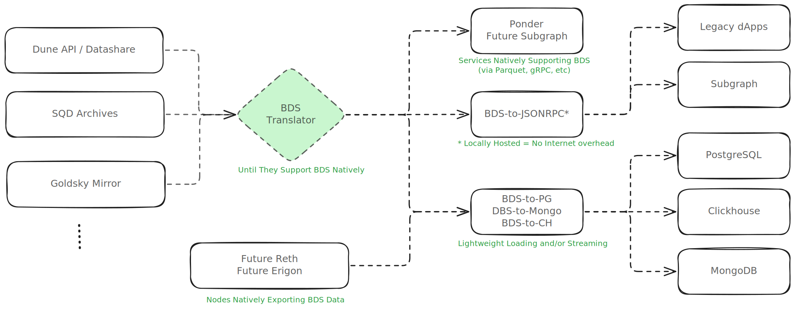

# Blockchain Data Standards - Manifesto
The entrypoint for learning about Blockchain Data Standards working group, manifesto, and relevant links.

* Telegram Group: http://t.me/blockchain_data_standards

## Current State: DRAFT 🧘

This manifest is in draft mode, meaning the inital idea is being put in place and comments and suggestions are welcome as nothing is yet committed.

## Participants

* Ozgur ([github/ozgrakkurt](https://github.com/ozgrakkurt)) - Steel Cake
* Storm ([github/sslivkoff](https://github.com/sslivkoff)) - Paradigm
* Mikko Ohtamaa ([x/moo9000](https://x.com/moo9000)) - Trading Protocol
* Swanny ([x/swanny14](https://x.com/swanny14)) - Swanware
* Rick Dudley ([github/afdudley](https://github.com/afdudley)) - Vulcanize
* Jason Smythe ([x/JasoonSmythe](https://x.com/JasoonSmythe)) - Envio
* Aram ([github/aramalipoor](https://github.com/aramalipoor)) - eRPC
* Kasra ([github/kasrakhosravi](https://github.com/kasrakhosravi)) - eRPC
* Parithosh Jayanthi ([github/parithosh](https://github.com/parithosh)) - Ethereum Foundation
* Matt Stam ([github/mattstam](https://github.com/mattstam)) - Succinct Labs
* Yule Andrade ([github/yulesa](https://github.com/yulesa))
* Shoham ([github/shohamc1](https://github.com/shohamc1)) - Erigon
* fucory.eth ([x/roninjin10](https://x.com/roninjin10)) - Tevm
* Sam Bacha ([github/sambacha](https://github.com/sambacha)) - Manifold
* Adam Fuller ([azfuller.com](https://www.azfuller.com/)) - The Graph
* Karel Balogh ([x/karelxfi](https://x.com/karelxfi)) - SQD
* Wesley Blake ([github/wesleycharlesblake](https://github.com/wesleycharlesblake)) - Chronicles
* Keri ([github/kclowes](https://github.com/kclowes)) - Ethereum / web3.py
* Preston Van Loon ([github/prestonvanloon](https://github.com/prestonvanloon)) - Prysm
* ...

> If you contribute to the conversations, manifesto, catalog, or libraries feel free to create a PR add your name and personal bio link

# 🤌 Purpose

This working group aims to unify blockchain data efforts by creating common standards (e.g. schemas) and tools.

At the moment, the focus is:

- **3️⃣ Schema / Structure / Semantics** is the main focus of the group, which is to create a common taxonomy for blockchain "raw data" so that providers of data, and consumers of data have lower barriers to entry.
- **4️⃣ Querying / Filtering** efforts are focused on common use-cases and access patterns based on real-world production applications. The BDS working group mainly provides best-practice conventions and specs but will NOT get into implementation details.
- **5️⃣ Transport** is how the data is technically delivered to consumers. The BDS working group will only offer recommendations and potentially useful libraries and tools (e.g. a translation tool between a gRPC data provider and a Subgraph which requires JSON-RPC)

### Quick Glossary

- **BDS** - Short for Blockchain Data Standards
- **Data Provider** - A company or open-source tool responsible for extracting raw blockchain data, enriching, massaging and post-processing to comply with the BDS specs.
- **Raw Data Indexing** - Process of extracting raw blockchain data (e.g. from underyling node leveldb, or via json-rpc) and normalizing it according to the BDS specs.
- **Data Consumer** - A consumer is interested in normalized blockchain data according to the BDS specs, with the purpose of building products on top of it.
- **Business Data Indexing** - Reading and processing of an already normalized BDS-compatible data to create high-level product-specific models (e.g. Subgraph or Ponder indexers, your custom data pipeline, etc).

## 🐞 Problems

Current state of blockchain data is fragmented and silod on one hand (with so many data providers each their own schema and semantics), and on the other hand, solutions like EVM JSON-RPC is not satisfying the current needs especially at higher production scale.

Here are some of the challenges and problems that the BDS working group aims to address:

1. JSON-RPC is plain-text and usually over HTTP which means:
    - **High bandwidth usage** for providers and consumers (vs a compact binary solution)
    - **High resources consumption** (Memory/CPU) for serializing and deserializing the data
2. RPC's standard JSON-RPC lacks advanced **querying or filtering capabilities** (e.g. all tokens of a wallet, transfers history etc).
3. High-throughput use-cases such as indexing full blockchain history is very costly and **time-consuming** via RPC nodes (vs streaming columnar binary data solutions such as Apache Arrow, or simple Parquet files).
4. Every 3rd-party provider or open-source tool has their own special flavor of **Data Schema and Transport** solution which, fragments the ecosystem. The only commonly adopted protocol is JSON-RPC, which has a lot of limitations, as described above.

## 🧘 Beliefs

- Node and clients are better suited to focus on core logic and consensus of the chain, and generate and deliver raw data as fast as possible to a "Data Provider" vs current JSON-RPC solution which is not scalable.
- Commonly agreed-upon standards (e.g. schemas, semantics) will create a robust and resilient ecosystem, and gives data consumers optionality between providers and many different chains, and gives providers lower barrier-to-entry in the market.

### Non-goals

* The BDS working group will not focus on underlying database or storage technologies.
* The BDS working group will not have an opinion on querying languages or engines, and will be left to the data providers to decide.

(TODO discuss and modify the above in the community call)

# 🌟 BDS v1.0 Catalog

> NOTE: This is hypothetical example. TBD during actual BDS working group effort and discussions.

* **EVM** - Ethereum Virtual Machine based blockchains, whether L1 or L2s.
    * [**Schemas**](./evm/schemas.md) - Common structure for Blocks, Transactions, Events & Logs, etc.
        * [Blocks](./evm/schemas.md#blocks)
        * [Transactions](./evm/schemas.md#transactions)
        * [Events](./evm/schemas.md#events)
        * _...TODO add actual schemas_
    * [**Open-source**](./evm/tools.md) - Tools to work with EVM data that comply with BDS v1.0 standards.
        * [cryo](https://github.com/paradigmxyz/cryo) - easiest way to extract blockchain data to parquet, csv, json, or python dataframes
        * [erpc](https://github.com/erpc/erpc) - RPC proxy and load-balancer compatible with BDS v1.0 data schemas
        * [evm-jsonrpc-2-bds](https://github.com/example/evm-jsonrpc-2-bds) -  _(hypothetical example)_ translate JSON-RPC to BDS v1.0
        * [bds-2-subgraph](https://github.com/example/bds-2-subgraph) -  _(hypothetical example)_ exposes BDS v1.0 compatible data sources to Subgraphs
        * [dune-2-bds](https://github.com/example/dune-2-bds) -  _(hypothetical example)_ translate Dune API to BDS v1.0
        * [bds-arrow-go](https://github.com/example/golang-bds-arrow) -  _(hypothetical example)_ Golang Apache Arrow definitions for BDS v1.0
        * [bds-arrow-typescript](https://github.com/example/typescript-bds-arrow) -  _(hypothetical example)_ TypeScript Apache Arrow definitions for BDS v1.0
        * _...TODO add actual tools_
    * [**3rd party**](./evm/3rd-party.md) - Proprietary providers of EVM data that comply with BDS v1.0 standards.
        * Subsquid
        * HyperSync
        * Goldsky
        * _...TODO add actual providers_

_TODO schemas to be added to the catalog based on existing work of top data providers_

> ^ How the blockchain data ecosystem will look like with BDS adoption.

### 🙏 Acknowledgements

Here the list of relevant/discussed providers, projects and tools working on blockchain data. Not all of them are contributing to or follow the BDS:

- [Dune Data Catalog](https://docs.dune.com/data-catalog/overview)
- [Subsquid Archive Nodes](https://docs.sqd.ai/subsquid-network/reference/evm-api/#data-requests)
- [Substreams Firehose](https://firehose.streamingfast.io/references/protobuf-schemas)
- [Goldsky Mirror](https://docs.goldsky.com/mirror/sources/direct-indexing#evm-chains)
- [Envio Hypersync](https://docs.envio.dev/docs/HyperSync/hypersync-query#data-schema)
- [cryo datasets](https://github.com/paradigmxyz/cryo?tab=readme-ov-file#cryo-datasets)
- [Primo Data Directory](https://www.primodata.org/blockchain-data)
- Feel free to add more to this list

# 🤝 Contributing

### Ideas & Suggestions

Feel free to create a [new Github Issue](https://github.com/blockchain-data-standards/manifesto/issues/new) to discuss ideas and suggestions, examples of good topics:
- "Add `blockTimestamp` to EVM.Schema.Event"
- "Require `chainId` on the EVM.Query.Transaction"
- "Introduce a new schema for traces under EVM.Schema.Trace"
- "Add Solana architecture to BDS catalog"
- "For each BDS schema and field add which provider/tool offers such data"
- ...

### Definitions & Standards

Before creating a new PR, make sure your changes are properly discussed and generally accepted by the community by creating a new issue as described above.

When enough consensus is reached, create a [new PR](https://github.com/blockchain-data-standards/manifesto/pulls) to add or modify definitions and standards.
